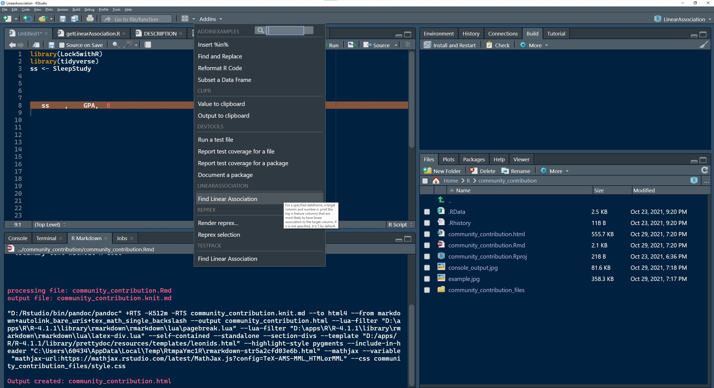

# Linear Association R Studio Plugin

Ruilin Liu and Zhifeng Zhang

### Introduction

In this community contribution project, we write a simple R addin project that helps us find out the linear association between feature columns and a target column in a data frame. The idea actually comes from problem sets 2 and 3 where we need to find if there is correlation between two variables. There are indeed several ways to do so like pair scatter plots and mosaic plots.

However, we want a simpler and more efficient way to do so. As learnt from statistic class, p-value in linear regression tests the null hypothesis that the coefficient is equal to zero. The lower the p-value, the stronger contribution of a feature column to the target column. 

Thus, we develop such idea that we can write a simple R addin that fits a linear model onto the target column and return top n feature columns that has the lowest p-values, or highest possibilities of having correlation with target column.

### Installation 
Link: https://github.com/gzmason/linear_association_rplugin/tree/main

1. Download the files in the above repo, or download the the zip file ***LinearAssociation.zip*** and unzip it. 
2. Open the project file ***LinearAssociation.Rproj*** in Rstudio.
3. On the top right panel under **Build**  sub panel, click **Install and Restart**.
4. Check the **Addins** menu if there is an addin called **Find Linear Association** under **LINEARASSOCIATION**. If so, you are done installing our addin.

### Usage

##### Note: This addin runs on library 'tidyverse'. Please run the following command first before running into next step!
`library(tidyverse)`

This addin will take three arguments in a line, **separated by commas**: 

* name of a data frame
* name of a target column
* number of columns, referred as n

and returns n number of feature columns that have highest probability of having linear correlation with target column.

Tips:

* This addin tolerates any white-space between and after arguments.
* The first two arguments are required, whereas the third argument n is optional. If not provided, n is 5 by default.
* The data frame has to be stored in the environment first, as this addin reads data frame from current environment variables. 
* n will be reset to 5 if any non-integer or negative value is passed.
* n will be capped at maximum number of feature columns if a greater number is passed.
* Currently, the target column can only contain continuous and numeric data, since we are using linear regression. Categorical target column is not supported!

##### Example
I am using SleepStudy example from PSet3 as an example. 

And the console output would be:

### Troubleshooting
1. "str_split" not found 

**Solution**: load tidyverse package
`library(tidyverse)`

2. Only showing one row of "NA"

**Solution**: change the target column to a continuous one. This addin does not support categorical target column as we are not doing logistic regression here. 

### Evaluation and Improvement

We have learnt a lot during the process of creating a small R addin project. At first it might seem a bit scary to write an addin since both of us have no clues what is going on here. But after reading some tutorials on how write an R addin, we find it rather simple and enjoying. It is needless to say that creating an R package of our own is of huge sense of accomplishment, though we have been through lots of trials and errors along the way. 

There are a number of ways that this little project can be improved. For example, adding a logistic regression feature to categorical target column. Evaluating more metrics regarding linear association rather than a simple p-value to achieve more comprehensive results. 
