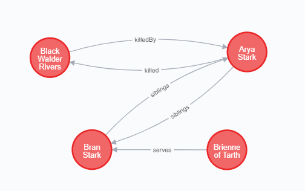
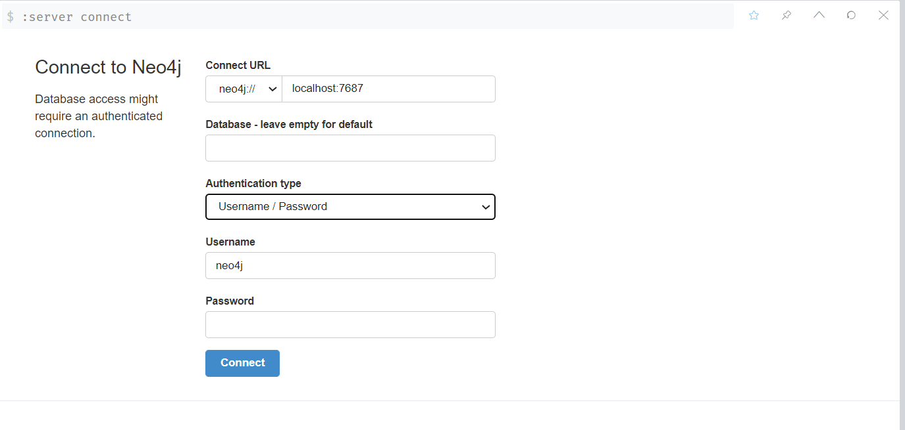

# From Neo4j to RStudio

Chaoying Zheng


### Introduction of Graph Database
  Graph database is designed to be very visual on the relationship of the data.The Six degree of separation is a popular example of how graph database helps in visualizing relationship. This theory also known as six handshake rule, which states that all people are six or fewer social connection away from each other. However, in the relational database, it is time consuming to find the relatinoship and generate the visualization. Therefore, graph database, one of the non-relational database, can help us handling with this type of data. On the other side, the table in non-relational database is not reading-friendly, converting them back to relational database can help to better understand the elements of the data.

  Neo4j is a software that widely used in visualizing graph database. At the same time, RStudio is a powerful tool in data visualization. So, the connection between these two tools can be very useful in analyzing data. 

  There are two key components in grpah database:node and edge. Each node and edge has label and properties. Neo4j uses Cypher query language, which is structured visually with ASCII-art to make query-building and maintenance easy to read and adapt. In this tutorial, Game of Thrones (GOT) data are used to illustrate.

  In the GOT databse, each node is a character, which all have the same label, named `charaters`, and same properties, `name` and `id`. Characters (nodes) are connected by different edges: "parents", "siblings", "killed", "allies", etc. Figure 1 shows partial graph of the GOT databse.





### Installation

#### Neo4j Installation
  First, install Neo4j (https://neo4j.com/docs/operations-manual/current/installation/) and run the databsae on the local machine. If you already install Neo4j, ignore this step.

#### R Package Installation


<!-- install.packages("neo4r") -->


### Connection
  After starting the graph database on Neo4j, open any brower and go to the default url (http://localhost:7474). Neo4j may require to enter the user and password for authentication, which is shown in Figure 2. All these information will repeat as the following code to connect RStudio with Neo4j. 




```r
library(neo4r)
con <- neo4j_api$new(
  url = "http://localhost:7474",
  user = "neo4j", 
  password = "password"
  )
```


### Retrieving data from Neo4j
The basic idea is to write the cypher query language and pass to the Neo4j connection created above with function `call_neo4j()`. The parameter `type` will convert the graph database table into a graph object in R. The query below extract all the characters that have "marriedEngaged" relationship with Sansa Stark. 

```r
library(dplyr)
library(purrr)
Sansa_Marriage <- 'MATCH a = (sansa:Character {name:"Sansa Stark"})-[:killed|marriedEngaged]-(c:Character) RETURN a' %>%
  call_neo4j(con, type="graph")
```

Next, convert all nodes and relationships into a relational table. (Reminder: the first col `id` is the unique id given by Neo4j by default, the last col `id1` is the character id for each character)

```r
Sansa_Marriage$nodes <- Sansa_Marriage$nodes %>%
  unnest_nodes(what = "properties") %>% 
  mutate(label = map_chr(label, 1))
(Sansa_Marriage$nodes)

Sansa_Marriage$relationships <- Sansa_Marriage$relationships %>%
  unnest_relationships() %>%
  select(startNode, endNode, type, everything())
(Sansa_Marriage$relationships)
```

### Visualize with ggraph
Also, we can use `ggprah` to regenerate the graph from the relational table. 

```r
library(ggraph)
graph_object <- igraph::graph_from_data_frame(
  d = Sansa_Marriage$relationships, 
  directed = TRUE, 
  vertices = Sansa_Marriage$nodes
)

graph_object %>%
  ggraph() + 
geom_node_label(aes(label = name)) +
geom_edge_link() + 
theme_graph()
```
